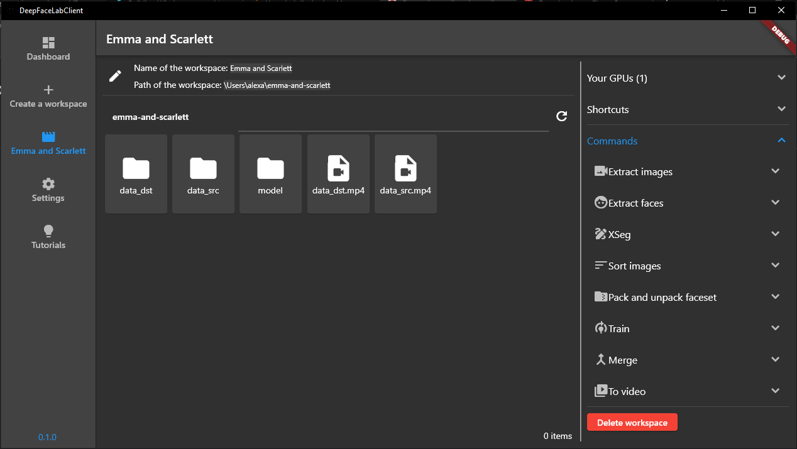
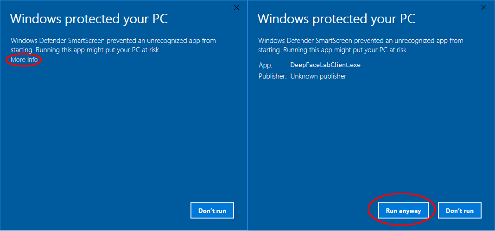

# DeepFaceLabClient

> [!CAUTION]
> I'm aware that for some people the GPU is not showing up in the GPU section https://github.com/Lenny4/DeepFaceLabClient/issues/73. As I don't have a graphic card I can't reproduce the bug and therefore I can't fix it. We are looking for someone who can actually reproduce the bug and has someone knowledge in Dart. This way I can connect to his PC with TeamViewer and try to fix it. If you are in this situation, please send me an email to `alexandre.beaujour@hotmail.fr`

Just an app to use [DeepFaceLab](https://github.com/iperov/DeepFaceLab) with a user interface.

## Requirements

Linux or Windows 10/11

## Install

Go to the [release page](https://github.com/Lenny4/DeepFaceLabClient/releases) and download the
latest release in the `Assets` section. Once downloaded just start `DeepFaceLabClient.exe` on windows
or `DeepFaceLabClient` on linux.

On windows you might have this message when starting DeepFaceLabClient

Click on "More info" and click on "Run anyway"

## Change log

Please see [CHANGELOG](CHANGELOG.md) for more information on what has changed recently.

## Testing

todo

## Contributing

Please see [CONTRIBUTING](CONTRIBUTING.md) for details.

## License

The GPL License. Please see [License File](LICENSE.md) for more information.
